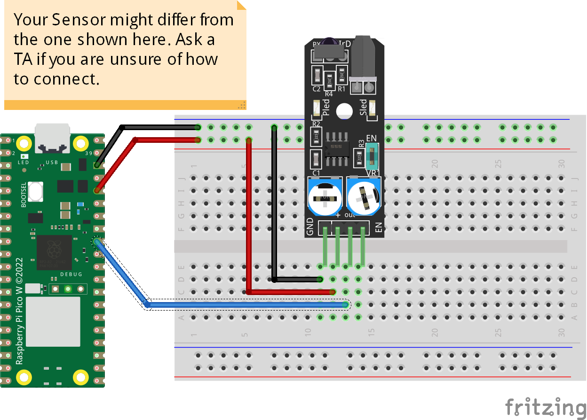

# Collision Detection Sensor
The code prints "Detected..." with onboard LED ON if an object be in the range and sensitivity of adjusted and prints "Safe to go..." with onboard LED OFF if the path is free. We can adjust the sensor range and sensitivity by turning two potentiometers to the side. Some of the sensors also have small LED as indicator.  

