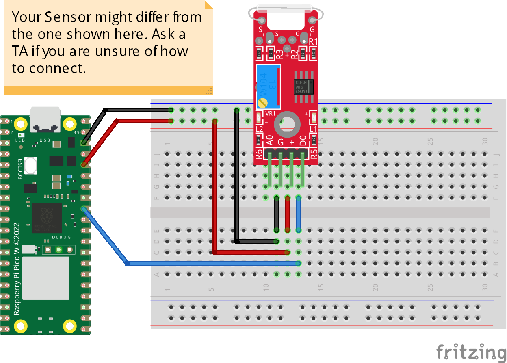

# Reed Switch
The code prints "Magnet Detected..." if there is a magnatic field strong enough with the sensor settings. We can adjust the sensor sensitivity with the potentiometer. This code use the digital pin we can use the sensor analog pin to show the magnetic field strength. 

