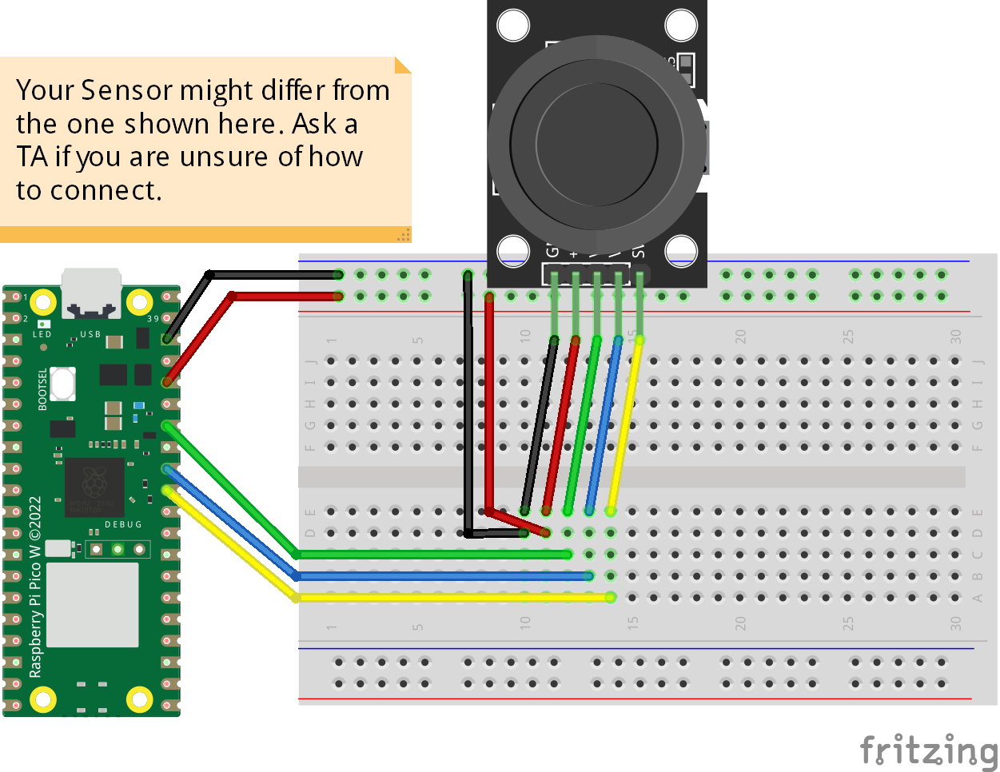

# Joystick
The code prints the value of analog port connected to x Axis and y Axis of the joystick with its direction if they are toward east, west, north, or south. It also prints if the joystick button clicked.

