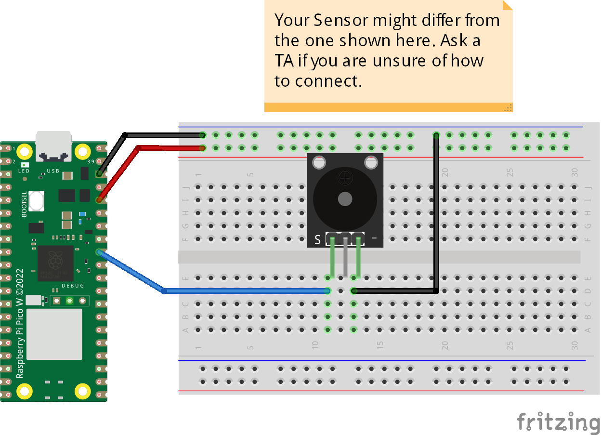

# Passive Piezo Buzzer
The code has two mains the first main (main1) contains a short song and a link above to describes details of implementation. Second main (main2) uses the libraty and contain several songs which plays longer musics.
## Credits
This library and main2 was forked from [James](https://github.com/james1236/buzzer_music), and main1 was adopted from [Avram Piltch](https://www.tomshardware.com/how-to/buzzer-music-raspberry-pi-pico) that describes the code in details.
