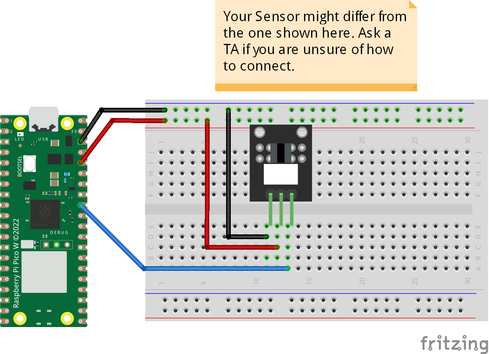

# Photo Interrupter
The sensor can be used in printers to indicate existance of paper in the tray. The code prints if a paper inserted between the block and print different message if no paper inserted. 

