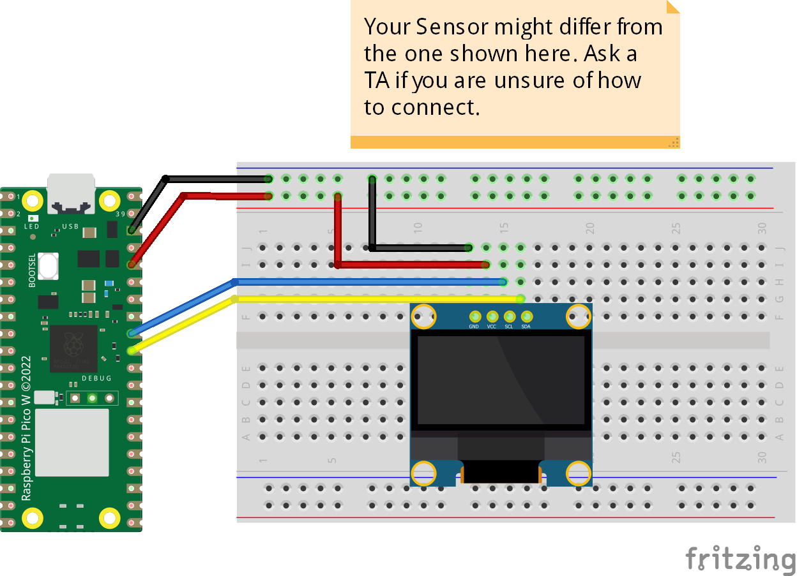

# OLED SSD1306 I2C 128x64 Display
The code displays different text and shapes using functions implemented in the library.
## Credits
This library was forked from [Stefan Lehmann](https://github.com/stlehmann/micropython-ssd1306).
