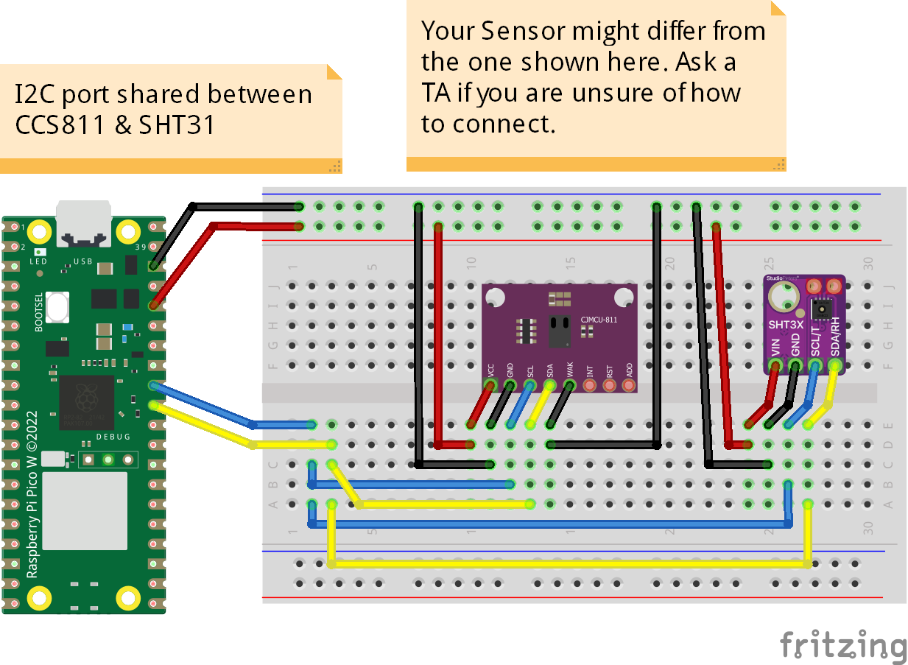

# CCS811 Air Quality and SHT31 Temperature and Humidity
Two sensors (CCS811 and SHT31) are connected to the same I2C port. SHT31 prints temperature and humidity and the values are used to compensate CCS811 error. CCS811 prints CO2 and tVOC values after measurement.
## Credits
The CCS811 library was forked from [Defraine Jean-Marie](https://gist.github.com/jiemde) and slightly change to work with RP2. The SHT31 library was forked from [K. Fricke](https://github.com/kfricke/micropython-sht31).
 
