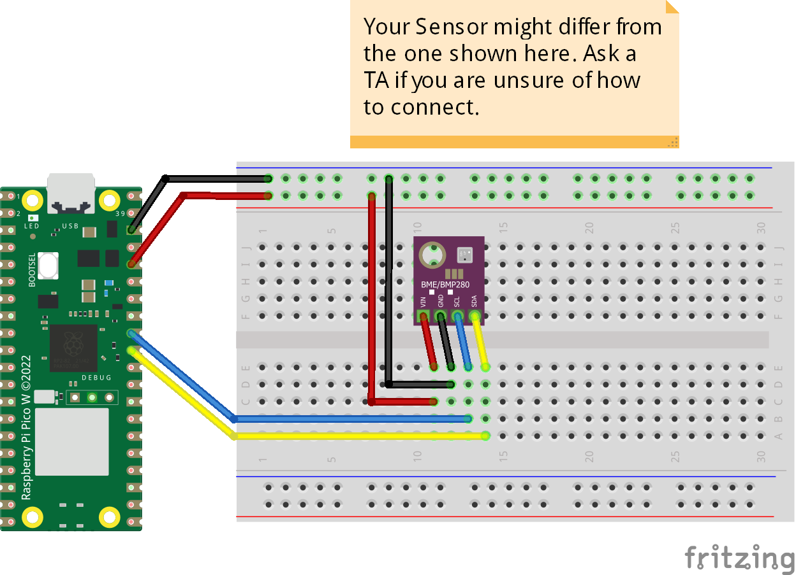

# BME280 Temperature-Humidity-Pressure
The code prints temperature, humidity, and pressure value from BME280.
## Credits
This library was forked from [random nerd tutorials](https://randomnerdtutorials.com/micropython-bme280-esp32-esp8266/) website.
