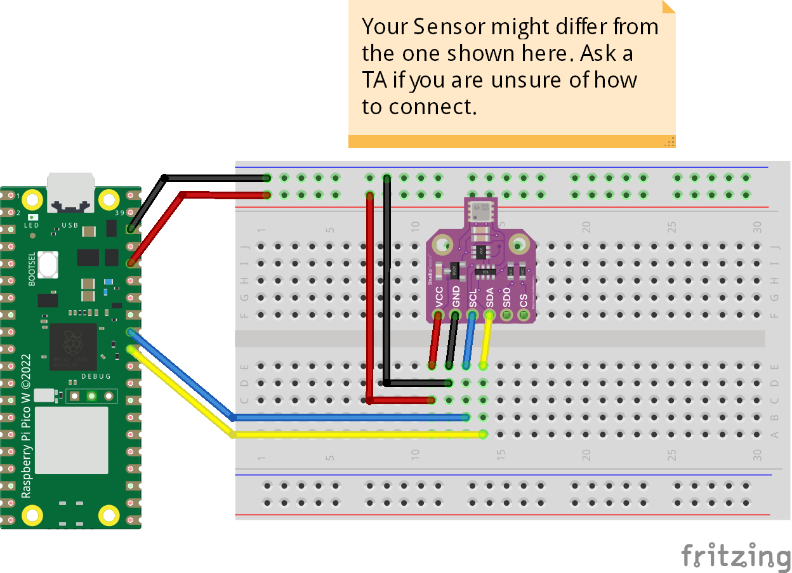

# BME680 Temperature-Humidity-Pressure-Gas
The code prints temperature, humidity, pressure, and gas value got from BME680. 
## Credits
This library was adopted from [random nerd tutorial](https://randomnerdtutorials.com/micropython-bme680-esp32-esp8266/) website.
