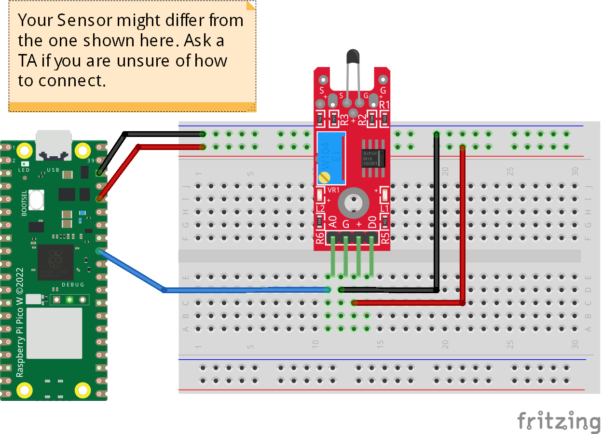

# NTC Thermistor (ADC conversion)
The code prints the sensor analog value and its conversion to Celsius. 
## Credits
This code adopted from [Bhavesh Kakwani](https://bhave.sh/micropython-measure-temperature/).
