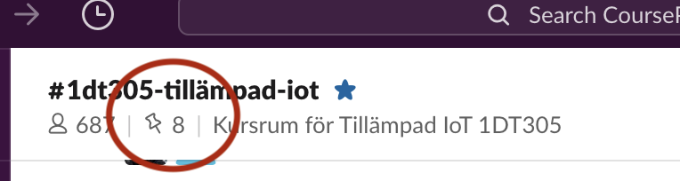

# Studieguide 1DT305
###### tags: 'study-guide' 'planning'

[Kursplan](https://kursplan.lnu.se/kursplaner/kursplan-1DT305-1.pdf)

## Översikt

- [Förväntningar](#Förväntningar)
- [Mål](#Mål)
- [Kommunikationstrategi](#Kommunikationstrategi)
- [Uppgifter](#Uppgifter)
- [Deadlines](#Deadlines)
- [Examination](#Examination)
- [Planering](#planering)

### Förväntningar

- Läs detta dokumentet **noggrant**. Återkoppla med kommentarer direkt om det är något som är oklart.
- Planera dina studier. Lägg in tid i din kalender för att lyssna på inspelat material, närvaro på workshops och för uppgifter.
- Fråga gärna dina frågor tidigt om något är oklart, vänta inte.
- Påbörja uppgifter i god tid innan deadline, annars finns mycket litet utrymme för att hinna hjälpa.
- **Interagera med studenter och lärare på Slack**. Fråga, och var inte rädd att svara på frågor från andra studenter. Kom ihåg - var trevlig och respektfull. Kursens framgång bygger på er medverkan.
- Framförallt - försök anamma en positiv inställning och ha kul.

### Mål

Målet med kursen är att du ska bygga en uppkopplad sensorenhet som ger ett mätvärde som presenteras över internet. I första hand kommer teknik specifikt för batterisnåla IoT-enheter att omfattas. Kursen är en **introduktionskurs**. Det är ditt eget lärande och intresse det handlar om, du kommer således ha stor möjlighet att styra ditt projekt efter egna önskemål.

Kursen har en praktisk inriktning och examination vilket innebär att en IoT-enhet med sensorer krävs för att kunna bli examinerad. Material rekommenderat enligt [Bill of Material](BOM-md) som bör införskaffas innan kursens start. Det går att använda andra enheter, om osäker fråga gärna i [#1dt305 på Slack](coursepress.slack.com).

## Kommunikationsstrategi

Då det är många studenter som läser kursen samtidigt är det mycket viktigt att alla gör sitt bästa för att följa denna strategin.

- *Personliga* frågor gällande formella medverkan på kursen, frånvaro, betyg skickas via email till kursansvarig, [Fredrik Ahlgren](mailto:fredrik.ahlgren@lnu.se).
- Frågor kring kursen, uppgifter, examination, schema, ställs i Slack i kanalen **#1dt305-tillämpad-iot**.
- Information gällande kursen kommer postas i **#1dt305-tillämpad-iot**. Viktig information kommer att delges här, och det är _viktigt_ att du läser allt.
- Reagera till **alla** 'pinned posts' på Slack. Ni kan filtrera ut dessa enligt figurer nedan.

Kursens föreläsningar och material kommer övervägande del vara på engelska, dock är kursens formella språk svenska. Vid frågor i Slack gällande hjälp om uppgifter kan det vara fördel att ställa dessa på engelska då det blir lättare för våra lärarassistenter att hjälpa.

## Uppgifter

| Kursmål			| Uppgift |
| :---: | :---: |
| grundläggande kunskap om området Internet of Things (IoT) | **Q1**
| grundläggande programmeringskunskaper i Python och MicroPython | **Q2**
| grundläggande kunskap om sensorer och datainsamling | **Q3**, R1
|  grundläggande kunskap om IoT­ infrastruktur och dess meddelandeprotokoll | **Q3**
| grundläggande kunskap om datavisualisering och databaser | **Q3**, T2
| praktisk grundläggande kunskap i att utveckla ett IoT­ projekt | P1, **T1**
| praktisk grundläggande kunskap gällande utskrift i 3D | **Q4**

**Fet stil** nivå godkänt (E - C).

<!---
**Q** = Quiz, **T** = Project report/Tutorial, **P** = Presentation.
--->

* **[Q1, Q2, Q3, Q4]**: *Quizzar* på Moodle
* **T1**: Grundläggande rapport, Moodle
* **T2**: Mer omfattande rapport, Moodle
* **P1**: Muntlig redovisning i seminarie

## Deadlines

Kursen börjar **måndagen den 8:e juni 2020** och slutar **söndagen den 12:e juli 2020**.

Samtliga moment ska vara genomförda innan kursens slut för ett betyg.

## Examination

Bedömning av de studerandes prestationer sker genom;

- Projektarbetet, en **Tutorial** som beskriver ditt projekt.
- Aktivt deltagande (via Quizar och diskussioner i Slack).

**OBS! Om ni önskar ett högre betyg än C** måste ni presentera och diskutera ert projekt, samt anmäla intresse för högre betyg senast **två veckor efter kursstart, den 22:a juni.** Detta görs via Zoom-workshop. OBS. Om ni ej gjort detta kan vi ej garantera ett högre betyg.

| Uppgift | Obligatorisk | Skala | Anm. |
| :---:	| :---: | :---: | --- |
| Q1 | **Ja**	| F/E | 	Quiz 1 - IoT definitioner
| Q2 | **Ja**	| F/E |	Quiz 2 - MicroPython
| Q3 | **Ja**	| F/E |	Quiz 3 - IoT sensorer, protokoll
| Q4 | **Ja**	| F/E |	Quiz 4 - 3D printing
| T1 | **Ja** | F-C | Grundläggande skriftlig tutorial, enklare projekt (*kan göras i grupp om max två*)
| T2 | Nej | C-A | Ersätter R1, utökad tutorial. Ett mer avancerat projekt (*måste göras enskild)**
| P1 | Nej | C-A | Projektdemo via video.

*För att kunna få högre betyg än C krävs enskild rapport på nivå **T2**. Det går också att få ett högre betyg genom att hjälpa andra studenter i Slack.

**Viktigt!** För ett betyg >=E krävs ett genomförande av Q1-Q4 samt R1 innan kursens slut.

## Planering

Kursen är fem veckor lång, varav de fyra första veckorna innehåller föreläsningar och workshops. Alla schemalagda föreläsningar och workshops är förlagda till kvällstid mellan måndag - torsdag.

Kursens [schema](planning.md) kommer uppdateras på kursens Github-sida [schema](planning.md), via Google Calendar samt via Slack. 

